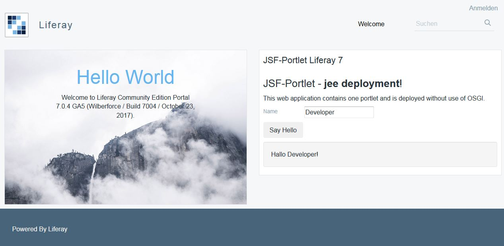

# liferay-jee-deploy

**This extension for Liferay enables traditional jee deployments for Liferay 7 **. 

## What does this mean?
- deploy a war artefact
- deploy with mechanisms of your application server
- application server knows your deployment
- no usage of OSGI

## Why that?

I do not want to start a debate about "is OSGI the right approach", but there
are several aspects, why you want to deploy in a traditional way:

*    use existing processes for deployment to your application server.          
	deployment piples (e.g. with jenkins), rolling update strategies, 
    cluster deployments,...

*    use features of your application server.      
     You can use features of your application server. In case of wildfly (10/11)
     you can use all JEE 7 features. For example: EJB, JPA, JTA.
     
*    use "infrastructure" of your application server  
     an application server provides useful "infrastructure". For example caches,
     connection pools, logging, Messaging Queues. 
 
*    use monitoring of your application server  
     you can monitor your applications with the capabilities of your application
     server. For example: request count, max request time, average request time, 

     
## How to achieve that?
*    put all needed jars to WEB-INF/lib  
     &rarr; No need to copy further jars during deployment-process
*    configuration is contained already  
     &rarr; No need to modify web.xml during deployment-process
*    additional configuration can be added dynamically during startup of the webapplication  
     &rarr; No need to modify web.xml during deployment-process
*    register portlets during startup of the webapplication  
     &rarr; No need to explicitly declare one servlet per portlet 
      
## Register portlets during startup of the webapplication

For convenience reasons the registration for your portlet webapplication can 
be done automatically:

*    add a servlet and a servlet-mapping for each portlet
*    add `com.liferay.portal.kernel.servlet.PluginContextListener` for your
     webapplication
     
## Use this on Wildfly 10 / Liferay 7

*    install module `org.liferayext.portal`
     `mvn package` builds the module, copy `liferay-jee-deploy-1.0.0-SNAPSHOT.jar` to `./liferay-ce-portal-7.0-ga5/wildfly-10.0.0/modules`

     **`module.xml`**
    
         <?xml version="1.0" encoding="UTF-8"?>
         <module xmlns="urn:jboss:module:1.1" name="org.liferayext.portal">

        	<resources>
	        	<resource-root path="liferay-jee-deploy-1.0.0-SNAPSHOT.jar" />
	    	</resources>

	    	<dependencies>
	    		<module name="javax.servlet.api" />
	    		<module name="javax.xml.bind.api" />
	    		<module name="javax.el.api" />
	    		<module name="org.jboss.modules" />
	    	</dependencies>
         </module> 

*    extend module `org.jboss.as.web`
     add module `org.liferayext.portal`.
     
     `modules.xml` in directory `./liferay-ce-portal-7.0-ga5/wildfly-10.0.0/modules/system/layers/base/org/jboss/as/web/main` add
     
		<module name="org.liferayext.portal" services="export" />

*   patch `com.liferay.faces.bridge.ext-5.0.1.jar`     
  
    This artefact does not work outside of an OSGI context: <https://issues.liferay.com/browse/FACES-3233>

    Simple Workaround to Patch this on your own:
     ** copy artefact `com.liferay.faces.bridge.ext-5.0.1.jar` of your m2-repository to `com.liferay.faces.bridge.ext-5.0.1-patched1.jar`
     ** remove 'META-INF/services/com.sun.faces.spi.FaceletConfigResourceProvider' and `META-INF/services/com.sun.faces.spi.FacesConfigResourceProvider`
 

## TODO:
*    build jboss-module using maven-plugin `de.smartics.maven.plugin:smartics-jboss-modules-maven-plugin`
*    check/enable support for Tomcat
*    use new Liferay Faces Bridge 4.1
*    use patch for `FACES-3233` when `com.liferay.faces.bridge.ext-5.0.1.jar` is availabe

----------

# Example Portlet

The artefact `lr7-jsf-portlet`contains a hello world portlet to demonstrate this. It is a jsf portlet.

     
    